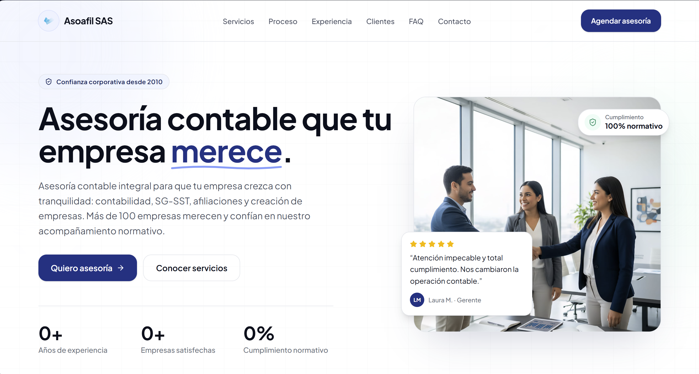
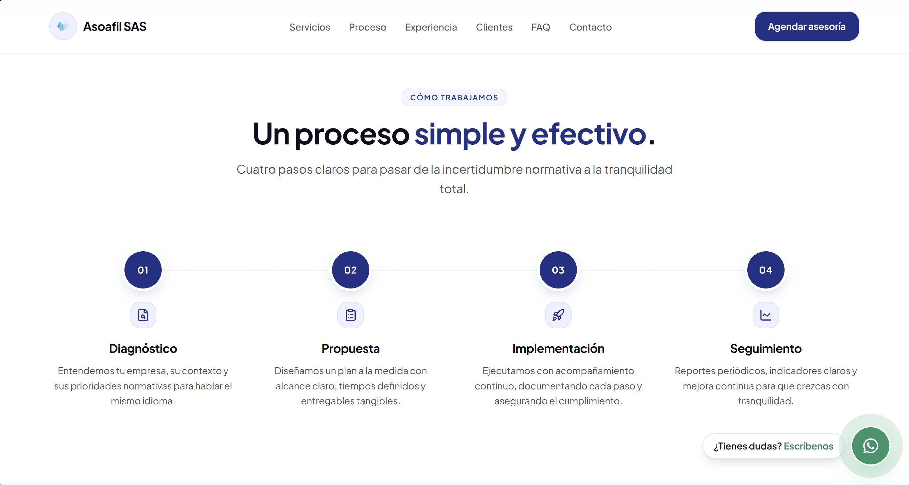
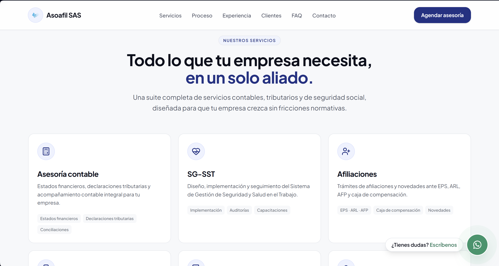
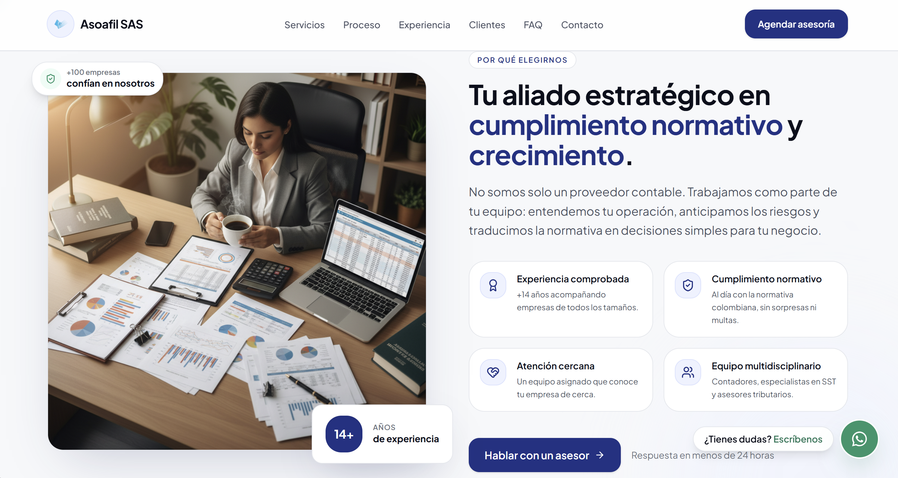
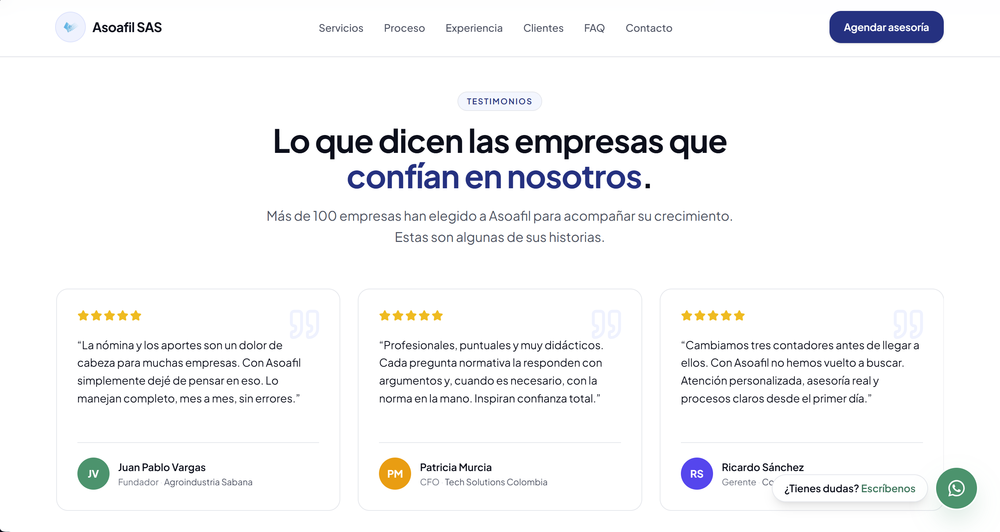
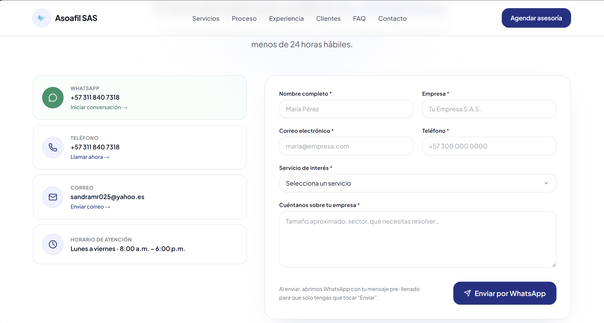
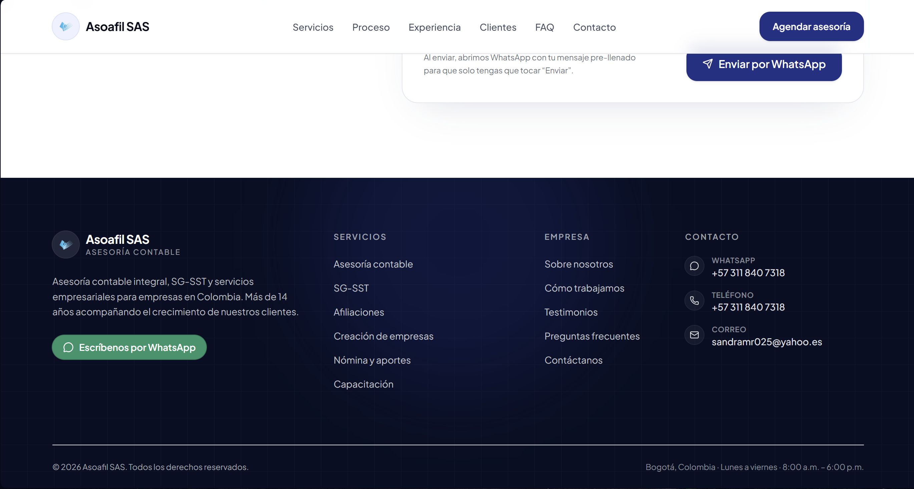

# Asoafil SAS — Sitio Web Corporativo

Sitio web oficial de **Asoafil SAS** — Asesoría contable, SG-SST, afiliaciones y servicios empresariales.

## Stack

- [Next.js 16](https://nextjs.org) (App Router, Static Export)
- [React 19](https://react.dev) + [TypeScript 5](https://www.typescriptlang.org)
- [Tailwind CSS 4](https://tailwindcss.com) (design tokens corporativos)
- [Framer Motion 12](https://www.framer.com/motion/) (animaciones)
- [Embla Carousel 8](https://www.embla-carousel.com) (carrusel de testimonios)
- [lucide-react](https://lucide.dev) (íconos)
- Tipografía: **Plus Jakarta Sans** vía `next/font`

## Requisitos

- Node.js 22+
- pnpm 10+

## Desarrollo local

```bash
pnpm install
pnpm dev
```

Abre [http://localhost:3000](http://localhost:3000).

## Scripts

| Comando | Descripción |
| --- | --- |
| `pnpm dev` | Servidor de desarrollo con HMR |
| `pnpm build` | Build de producción + static export en `out/` |
| `pnpm start` | Servidor de producción (no aplica con static export) |
| `pnpm lint` | Análisis de código con ESLint |

## Estructura

```
src/
├── app/                    # Rutas Next.js (App Router)
│   ├── layout.tsx          # Layout raíz + metadata + JSON-LD
│   ├── page.tsx            # Home (Hero, Servicios, Proceso, etc.)
│   ├── sitemap.ts          # Sitemap.xml generado
│   ├── robots.ts           # Robots.txt generado
│   └── globals.css         # Design tokens (colores, tipografía, sombras)
├── components/
│   ├── ui/                 # Button, Container, SectionHeading
│   ├── sections/           # Cada sección de la home
│   ├── site-header.tsx     # Header sticky con menú móvil
│   ├── site-footer.tsx     # Footer corporativo
│   ├── whatsapp-fab.tsx    # Botón flotante WhatsApp
│   └── animated-counter.tsx
└── lib/
    ├── site-config.ts      # Contacto, WhatsApp, nav links, stats
    └── utils.ts            # Utilidad cn() para clases
```

## Deploy

El sitio se compila como **HTML/JS/CSS estático** (`output: "export"`) y se publica
automáticamente en **GitHub Pages** con el workflow `.github/workflows/deploy.yml`
en cada push a `main` o `master`.

Para hacer build manual:

```bash
pnpm build
```

El sitio listo para publicar queda en la carpeta `out/`.

## Contacto

- **WhatsApp**: [+57 311 840 7318](https://wa.me/573118407318)
- **Correo**: sandramr025@yahoo.es
- **Web**: [asoafil.com](https://asoafil.com)

## 🖼️ Capturas de Pantalla

### Inicio


### Nosotros


### Servicios


### Productos


### Contacto


### Login


### Dashboard


---

© Asoafil SAS · Todos los derechos reservados.
