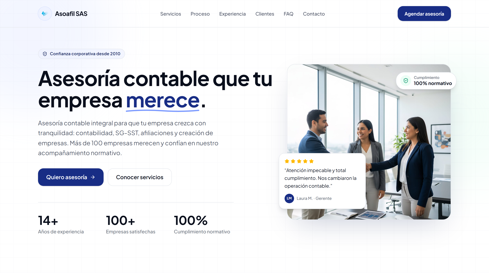
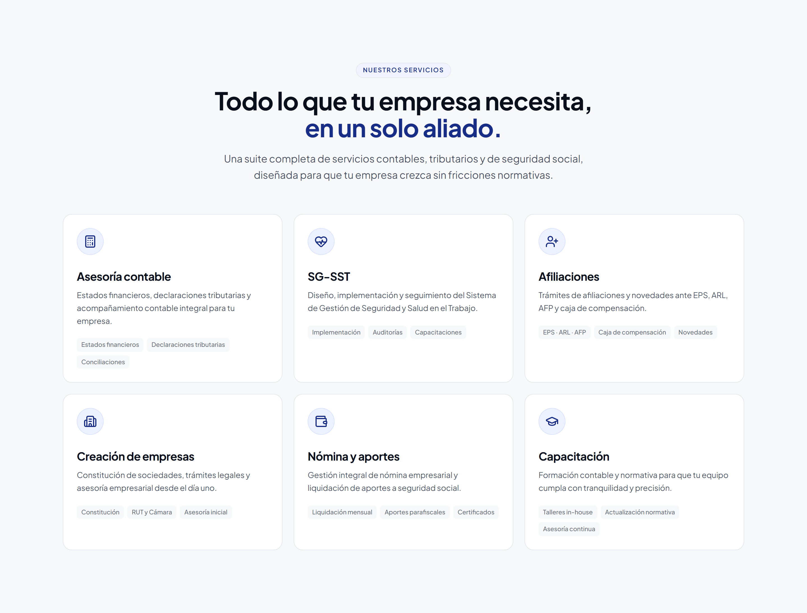
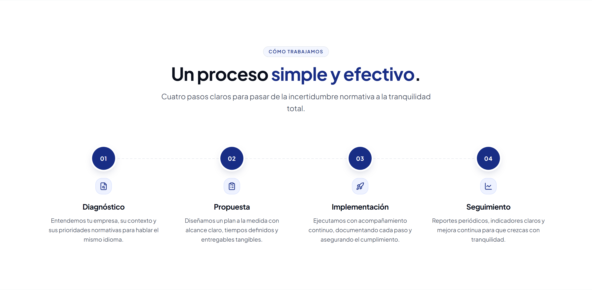
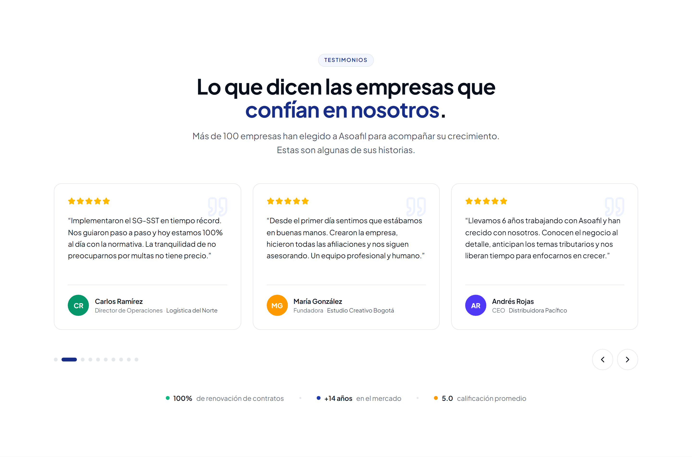
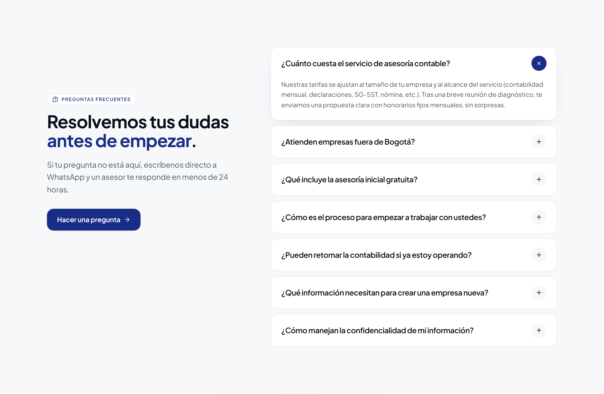
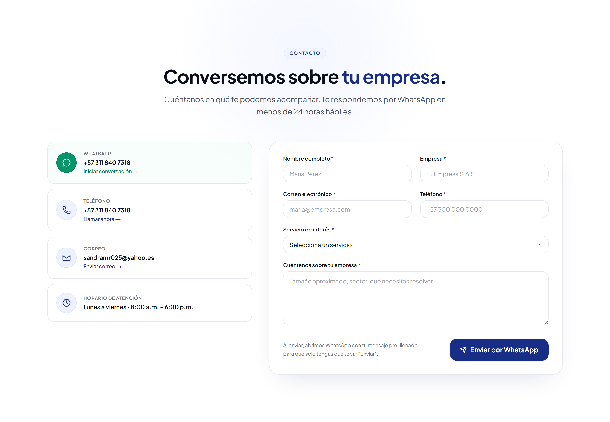
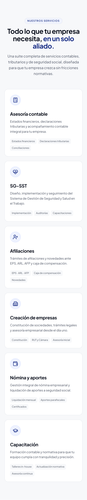

# Asoafil SAS — Sitio Web Corporativo

> Sitio web corporativo de **Asoafil SAS**, firma de asesoría contable en Colombia: una landing page de una sola página con hero, servicios, proceso de trabajo, experiencia, testimonios, preguntas frecuentes y contacto. Optimizada para SEO, 100% responsive y desplegada como sitio estático en GitHub Pages. Construida con Next.js 16, React 19 y Tailwind CSS 4.


**Sitio en producción:** [asoafil.com](https://asoafil.com)

## Inicio rápido

Necesitas Node.js 22+ y pnpm 10+.

```bash
git clone https://github.com/<usuario>/Asoafil.git
cd Asoafil
pnpm install

pnpm dev            # arranca en http://localhost:3000
```

Abre `http://localhost:3000`. Para generar el sitio estático listo para publicar, mira [Despliegue](#despliegue).

## Características

- **Hero**: titular con CTA a WhatsApp, métricas clave (14+ años, 100+ empresas, 100% cumplimiento), sello de confianza y tarjeta de testimonio.
- **Servicios**: seis tarjetas (asesoría contable, SG-SST, afiliaciones EPS/ARL/AFP, creación de empresas, nómina y aportes, capacitación), cada una con sus etiquetas de alcance.
- **Proceso**: cuatro pasos claros — diagnóstico, propuesta, implementación y seguimiento.
- **Experiencia**: bloque de credibilidad con los diferenciales de la firma (trayectoria, cumplimiento, acompañamiento y equipo).
- **Clientes**: carrusel de testimonios con autoplay (Embla Carousel).
- **FAQ**: acordeón con las preguntas más frecuentes.
- **Contacto**: tarjetas de contacto directo (WhatsApp, teléfono, correo y horario) y un **formulario que arma el mensaje y lo abre en WhatsApp** (sin backend).
- **Botón flotante de WhatsApp** presente en toda la página y **header sticky** con menú móvil.
- **SEO técnico**: metadata Open Graph y Twitter, datos estructurados JSON-LD (`ProfessionalService`), `sitemap.xml` y `robots.txt` generados.
- **Diseño responsive** con tokens de diseño corporativos y animaciones de entrada (Framer Motion).

## Capturas

Página de inicio con titular, métricas y testimonio destacado:



| Servicios | Proceso |
| --- | --- |
|  |  |

| Experiencia | Clientes |
| --- | --- |
|  |  |

| Preguntas frecuentes | Contacto |
| --- | --- |
|  |  |

Versión móvil (inicio, servicios y contacto):

| Inicio | Servicios | Contacto |
| --- | --- | --- |
|  |  |  |

## Stack tecnológico

| Capa | Tecnologías |
| --- | --- |
| Framework | Next.js 16 (App Router, `output: "export"`), React 19, TypeScript 5 |
| Estilos | Tailwind CSS 4, tokens de diseño en `globals.css`, tipografía Plus Jakarta Sans (`next/font`) |
| Animación | Framer Motion 12 |
| UI | Embla Carousel 8 (testimonios), lucide-react (íconos), `class-variance-authority` + `tailwind-merge` |
| SEO | Metadata API, JSON-LD, `sitemap.ts`, `robots.ts` |
| Despliegue | Exportación estática + GitHub Pages (GitHub Actions) |

## Estructura del proyecto

```
Asoafil/
├── public/                       # Activos estáticos (logo, favicon, imágenes, CNAME)
├── screenshots/                  # Capturas usadas en este README
├── src/
│   ├── app/
│   │   ├── layout.tsx            # Layout raíz: metadata, íconos y JSON-LD
│   │   ├── page.tsx              # Home: compone todas las secciones
│   │   ├── sitemap.ts            # sitemap.xml generado
│   │   ├── robots.ts             # robots.txt generado
│   │   └── globals.css           # Tokens de diseño (colores, tipografía, sombras)
│   ├── components/
│   │   ├── ui/                   # Button, Container, SectionHeading
│   │   ├── sections/             # hero, services, process, about, testimonials, faq, contact
│   │   ├── site-header.tsx       # Header sticky con menú móvil
│   │   ├── site-footer.tsx       # Footer corporativo
│   │   ├── whatsapp-fab.tsx      # Botón flotante de WhatsApp
│   │   └── animated-counter.tsx  # Contador animado de métricas
│   └── lib/
│       ├── site-config.ts        # Contacto, WhatsApp, nav links y métricas
│       └── utils.ts              # Utilidad cn() para clases
├── next.config.ts                # Static export + imágenes sin optimizar
└── .github/workflows/deploy.yml  # CI/CD a GitHub Pages
```

## Scripts

| Comando | Descripción |
| --- | --- |
| `pnpm dev` | Servidor de desarrollo con HMR en `http://localhost:3000`. |
| `pnpm build` | Build de producción + exportación estática a la carpeta `out/`. |
| `pnpm start` | Servidor de producción (no aplica con static export). |
| `pnpm lint` | Análisis de código con ESLint. |

## Configuración

El sitio no necesita variables de entorno. Toda la información editable de la empresa vive en un único archivo:

| Archivo | Qué contiene |
| --- | --- |
| `src/lib/site-config.ts` | Nombre, URL, datos de contacto (teléfono, correo, dirección, horario), número y mensajes de WhatsApp, métricas (años, empresas, cumplimiento) y enlaces de navegación. |
| `src/app/globals.css` | Tokens de diseño: paleta corporativa, tipografía y sombras. |
| `src/app/layout.tsx` | Metadata SEO (título, descripción, Open Graph), íconos y datos estructurados JSON-LD. |

Para cambiar el número de WhatsApp, el correo o las estadísticas, edita `siteConfig` en `src/lib/site-config.ts`; los cambios se reflejan en todo el sitio.

## Despliegue

El proyecto se compila como **HTML/CSS/JS estático** (`output: "export"`) y se publica en **GitHub Pages** mediante el workflow `.github/workflows/deploy.yml`, que se ejecuta en cada push a `main` o `master`:

1. Instala dependencias con `pnpm install --frozen-lockfile`.
2. Ejecuta `pnpm build` (genera la carpeta `out/`).
3. Añade `.nojekyll` y sube el artefacto a GitHub Pages.

El dominio personalizado se define en `public/CNAME` (`asoafil.com`). Para construir manualmente:

```bash
pnpm build      # el sitio listo para publicar queda en out/
```

## Contacto

- **WhatsApp / Teléfono**: [+57 311 840 7318](https://wa.me/573118407318)
- **Correo**: sandramr025@yahoo.es
- **Web**: [asoafil.com](https://asoafil.com)

---

© Asoafil SAS · Todos los derechos reservados.
